# 🧸 Teddy - Sistema de Gerenciamento de Clientes

> Sistema completo de gerenciamento de clientes desenvolvido com arquitetura de **microfrontends**, utilizando **React 19**, **TypeScript**, **Tailwind CSS** e **Module Federation** com **Vite 7**.

## 🚀 Visão Geral

O Teddy é uma aplicação moderna que implementa arquitetura de microfrontends, permitindo desenvolvimento, deploy e manutenção independentes de cada módulo. O sistema consiste em três aplicações principais que se comunicam entre si para oferecer uma experiência completa de gerenciamento de clientes, utilizando as tecnologias mais recentes do ecossistema React.

### ✨ Funcionalidades Principais

- 🔐 **Sistema de Login** - Autenticação simples com persistência de dados via localStorage
- 👥 **Dashboard de Clientes** - Interface completa para visualização e gerenciamento
- 📊 **Paginação Dinâmica** - Sistema avançado de paginação com controle flexível de itens
- 🎨 **Interface Responsiva** - Design moderno com Tailwind CSS 3.4+
- 🔄 **Navegação entre Apps** - Comunicação seamless entre microfrontends via Module Federation
- 🐳 **Deploy com Docker** - Containerização completa com Nginx para produção
- 🏗️ **Arquitetura DDD** - Domain-Driven Design com separação clara de responsabilidades
- 🛡️ **TypeScript Strict** - Tipagem rigorosa para maior confiabilidade
- ⚡ **Vite 7** - Build tool ultrarrápido com HMR

## 🏗️ Arquitetura do Sistema

### Estrutura de Microfrontends

```
📁 teddy/
├── 🎯 apps/                          # Aplicações de microfrontend
│   ├── 🚪 entry-app/                 # Shell app (aplicação host)
│   │   ├── src/pages/Entry.tsx       # Tela de entrada/login
│   │   ├── vite.config.ts            # Config Module Federation (host)
│   │   └── 🌐 Port: 3000
│   │
│   ├── 👨‍💼 manage-customers-app/       # Dashboard principal (remote)
│   │   ├── src/ManageCustomersApp.tsx # App principal
│   │   ├── src/domain/               # Domain layer (DDD)
│   │   ├── src/features/             # Features organizadas
│   │   ├── src/store/                # Redux Toolkit + Saga
│   │   ├── src/contexts/             # React Context APIs
│   │   ├── vite.config.ts            # Config Module Federation (remote)
│   │   └── 🌐 Port: 3001
│   │
│   ├── 👀 view-customers-app/         # Visualização de clientes (remote)
│   │   ├── src/ViewCustomersApp.tsx  # App de visualização
│   │   ├── src/pages/                # Páginas da aplicação
│   │   ├── src/features/             # Features específicas
│   │   ├── vite.config.ts            # Config Module Federation (remote)
│   │   └── 🌐 Port: 3002
│   │
│   └── 🐚 shell-app/                 # Shell compartilhado (em desenvolvimento)
│
├── 📦 packages/                      # Bibliotecas compartilhadas
│   └── ui/                           # Componentes UI reutilizáveis
│       ├── src/Button.tsx            # Componentes base
│       ├── src/icons/                # Ícones personalizados
│       └── src/contexts/             # Contexts compartilhados
│
├── ⚙️ config/                        # Configurações compartilhadas
│   ├── tailwind/base.config.js       # Config base Tailwind CSS
│   ├── postcss/base.config.js        # Config base PostCSS  
│   ├── typescript/base.tsconfig.json # Config base TypeScript
│   └── eslint/base.config.js         # Config base ESLint
│
├── 🐳 docker-compose.yml             # Orquestração de containers
├── 📦 package.json                   # Workspace configuration
└── 🔧 eslint.config.js               # Config ESLint global
```

### Fluxo de Navegação

```mermaid
graph TD
    A[👤 Entry App :3000<br/>Shell/Host App] --> B[📝 Login Form]
    B --> C[💾 localStorage<br/>User Data]
    C --> D[🔄 Module Federation<br/>Load Remote Apps]
    D --> E[🎯 Manage Customers App :3001<br/>Remote App]
    D --> F[👀 View Customers App :3002<br/>Remote App] 
    E --> G[📊 Dashboard with Clients]
    F --> H[📋 Client List View]
    G --> I[🔄 Inter-app Communication]
    H --> I
    I --> J[🛡️ Shared State Management]
```



## 🛠️ Tecnologias Utilizadas

| Categoria           | Tecnologias                                    | Versão    |
| ------------------- | ---------------------------------------------- | --------- |
| **Frontend**        | React, TypeScript, Tailwind CSS               | 19.1, 5.8, 3.4 |
| **Build System**    | Vite, Module Federation                        | 7.0, 1.4  |
| **State Management** | Redux Toolkit, Redux Saga, Context API        | Latest    |
| **Arquitetura**     | Microfrontends, Monorepo Workspaces, DDD      | -         |
| **Containerização** | Docker, Docker Compose, Nginx                 | Latest    |
| **Linting/Quality** | ESLint 9, TypeScript Strict Mode              | 9.30, 5.8 |
| **Estilização**     | Tailwind CSS, PostCSS, Lucide Icons           | 3.4, 8.4, 0.525 |
| **Routing**         | React Router DOM                               | 7.7       |

## 📋 Pré-requisitos

Certifique-se de ter instalado:

- **Node.js** >= 18.0.0
- **npm** >= 8.0.0
- **Docker** >= 20.0.0 (para deploy)
- **Docker Compose** >= 2.0.0 (para deploy)

## 🚀 Instalação e Execução

### 1️⃣ Desenvolvimento Local

```bash
# Clone o repositório
git clone <repository-url>
cd teddy

# Instale as dependências do workspace principal
npm install

# Instale dependências de todos os apps
npm run install:all
```

### 2️⃣ Executando em Modo de Desenvolvimento

#### Opção A: Executar todos os apps simultaneamente

```bash
# Inicia todos os microfrontends
npm run dev:all
```

#### Opção B: Executar individualmente

```bash
# Terminal 1 - Entry App
npm run dev -w apps/entry-app

# Terminal 2 - Manage Customers App
npm run dev -w apps/manage-customers-app

# Terminal 3 - View Customers App
npm run dev -w apps/view-customers-app
```

### 3️⃣ URLs de Desenvolvimento

Após iniciar os serviços:

- 🚪 **Entry App (Login)**: http://localhost:3000
- 👨‍💼 **Manage Customers**: http://localhost:3001
- 👀 **View Customers**: http://localhost:3002

## 🐳 Deploy com Docker

### Executar com Docker Compose

```bash
# Build e execução de todos os containers
docker-compose up --build -d

# Verificar status dos containers
docker-compose ps

# Parar todos os containers
docker-compose down
```

### Comandos Docker Individuais

```bash
# Build individual
docker-compose build entry-app
docker-compose build manage-customers-app
docker-compose build view-customers-app

# Executar individual
docker-compose up entry-app -d
docker-compose up manage-customers-app -d
docker-compose up view-customers-app -d
```

### URLs de Produção (Docker)

- 🚪 **Entry App**: http://localhost:3000
- 👨‍💼 **Manage Customers**: http://localhost:3001
- 👀 **View Customers**: http://localhost:3002

## 🎯 Como Usar o Sistema

### 1. Tela de Login (Entry App)

1. Acesse http://localhost:3000
2. Digite seu nome no campo de entrada
3. Clique em "Entrar"
4. Você será redirecionado automaticamente para o dashboard

### 2. Dashboard Principal (Manage Customers App)

- ✅ Visualização de lista de clientes paginada
- 🎛️ Controle de itens por página (5, 10, 15, 20, 25, 30, 35, 40)
- 🔄 Navegação avançada com sidebar responsiva
- 👤 Exibição do nome do usuário logado
- 📱 Interface totalmente responsiva

### 3. Funcionalidades Principais

- **Paginação Inteligente**: Sistema que adapta a visualização baseado no total de páginas
- **Sidebar Dinâmica**: Menu lateral que pode ser recolhido/expandido
- **Persistência de Dados**: Nome do usuário mantido entre navegações via localStorage
- **Design Responsivo**: Interface otimizada para desktop, tablet e mobile

## 🧪 Scripts Disponíveis

```bash
# Desenvolvimento
npm run dev:all              # Inicia todos os apps
npm run dev -w <app-name>    # Inicia app específico

# Build
npm run build:all            # Build de todos os apps
npm run build -w <app-name>  # Build de app específico

# Linting
npm run lint:all             # Lint de todos os apps
npm run lint -w <app-name>   # Lint de app específico

# Docker
docker-compose up --build -d # Deploy completo
docker-compose ps           # Status dos containers
docker-compose logs <app>   # Logs de container específico
```

## 🔧 Configuração e Personalização

### Modificar Portas de Desenvolvimento

Edite os arquivos `vite.config.ts` de cada app:

```typescript
// apps/entry-app/vite.config.ts
server: {
  port: 3000,
  // outras configurações...
}
```

### Configurar Itens por Página

No arquivo `Dashboard.tsx`:

```typescript
const [itemsPerPage, setItemsPerPage] = useState(15); // valor padrão
```

### Personalizar Estilos

As configurações do Tailwind estão em:

- `config/tailwind/base.config.js` - Configuração global
- `apps/*/tailwind.config.js` - Configurações específicas por app

## 🐛 Solução de Problemas

### Problema: Apps não carregam após build

```bash
# Limpar cache e reinstalar
rm -rf node_modules package-lock.json
npm install
npm run build:all
```

### Problema: Erro de CORS entre microfrontends

Verificar configurações do Vite em cada `vite.config.ts`:

```typescript
server: {
  cors: true,
  headers: {
    'Access-Control-Allow-Origin': '*'
  }
}
```

### Problema: localStorage não persiste

Verificar se ambos os apps estão na mesma origem (`localhost`).

### Problema: Containers Docker não iniciam

```bash
# Verificar logs
docker-compose logs entry-app
docker-compose logs manage-customers-app

# Rebuild forçado
docker-compose build --no-cache
```

## 📁 Estrutura Detalhada dos Arquivos

```
📁 apps/entry-app/
├── 📄 src/pages/Entry.tsx       # Componente principal de login
├── 🎨 src/index.css             # Estilos globais
├── ⚙️ vite.config.ts            # Config Vite + Module Federation
└── 🐳 Dockerfile               # Container para produção

📁 apps/manage-customers-app/
├── 📄 src/pages/Dashboard.tsx   # Dashboard principal
├── 🧩 src/components/
│   ├── Sidebar.tsx             # Menu lateral
│   └── icons/logo.tsx          # Logo da aplicação
├── ⚙️ vite.config.ts            # Config Vite + Module Federation
└── 🐳 Dockerfile               # Container para produção

📁 config/
├── 🎨 tailwind/base.config.js   # Config base do Tailwind
├── 📝 postcss/base.config.js    # Config base do PostCSS
├── 🔍 typescript/base.tsconfig.json # Config base do TypeScript
└── ✅ eslint/base.config.js     # Config base do ESLint
```

## 🤝 Contribuindo

1. Fork o projeto
2. Crie uma branch para sua feature (`git checkout -b feature/AmazingFeature`)
3. Commit suas mudanças (`git commit -m 'Add some AmazingFeature'`)
4. Push para a branch (`git push origin feature/AmazingFeature`)
5. Abra um Pull Request

## 📝 Licença

Este projeto está sob a licença MIT. Veja o arquivo `LICENSE` para mais detalhes.

---

**Desenvolvido com ❤️ usando arquitetura de microfrontends**
